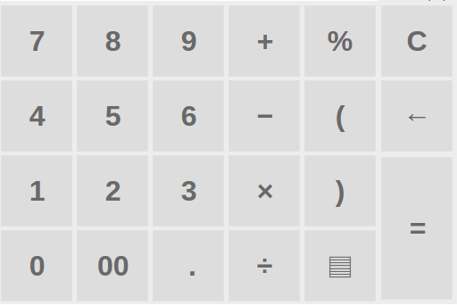
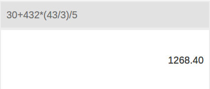
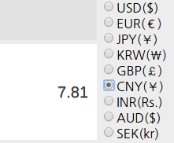
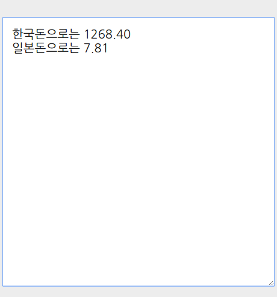

# CRP

 

### Before use  
CRP.html -> line 141  
app_id = ********  
You need to change that part after receiving the API in the path below.  
> https://openexchangerates.org/

### How to use
  
- Numbers and symbols function like normal calculators.
- ▤  = View current exchange rate

  
- Show calculation history and results.
- Two decimal for a better view.

  
- If you click on the rate, the exchange rate will be changed.

  
- You can write down what you need while doing the calculation.
